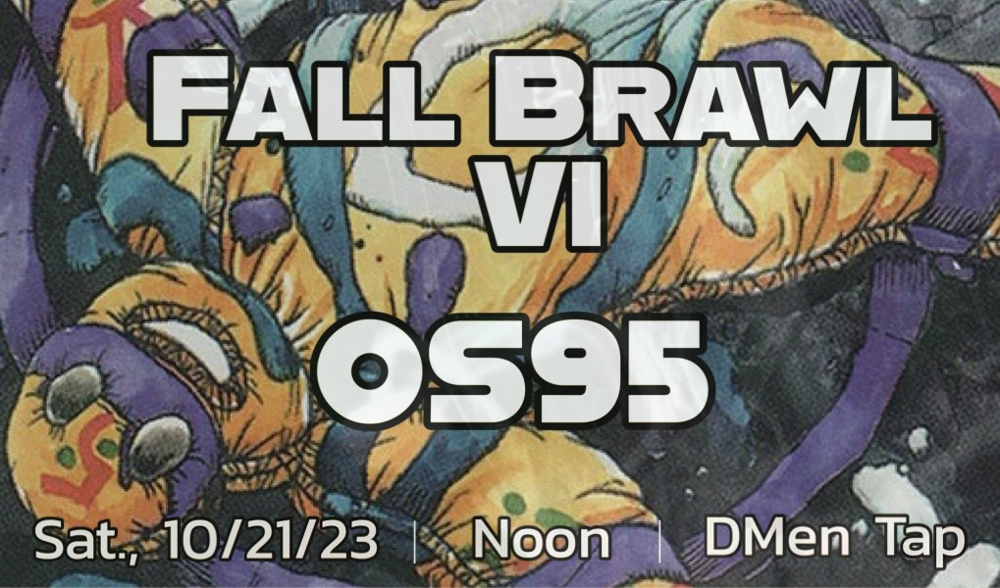

[TYLER, PLEASE USE LESHRAC'S RITE AS OUR HEADER IMAGE]

After a slow-burning summer for old school MTG in the City of Chicago, 19 Lords gathered at DMen Tap for our annual autumnal OS95 shootout - the Fall Brawl. This being the sixth iteration of our fall classic, we’re all familiar enough by now with the ebbs and flows of this Old School + _Ice Age_ format, so thusly submitted is a barebones reportage...

For the results-oriented reader, McCarthy bested a logjam of 4-1 players with BR Necropotence, and the Holy Trinity of Sweathoggery rounded out the 4-1s: White Weenie (Moss), UW Control (Petray) and Esper NecroMirror (Elleman). See the gallery below for a full detailing of the day's siq brews & stews. As part of the meetup, the Lords sponsored DMen’s community meal program, donating $400.

In club news, after Round 1 we took a short break to induct two new Lords, our old school stalwarts from the North Woods, Mike Butzen and Robert Vincent. Welcome to Lord Butzen and Lord Vincent!

To honor this sixth installment of the Fall Brawl, here’s a look at some format staples _Ice Age_ has brought to the card table over the years:

**Glacial Chasm** - an all-star card that one time in Danny’s deck.

**Stormbind** - the only Gold card on this list; it gives red decks the ability to close out close games.

**Portent** - lets blue durdle decks durdle even more. (Note: Brainstorm isn’t on this list because of a dearth of shuffle effects to abuse it, aside from Land Tax.) 

**Dance of the Dead** - this one’s taken a hit now that Reanimator’s best days are behind it.

**Mystic Remora** - underrated but gaining appreciation. For one mana you can usually draw at least 3+ cards.

**Incinerate** - big brain players love this burn card.

   
**Mana Crypt** - it’s free mana and thus restricted.

**Zuran Orb** - probably overrated but nevertheless appears in most decks as it lets players trade lands to hang on at the end of games.

**The Pain Lands** - mana fixing is always in-style.

**Black & White Pump Knights** - a slight edge to black here for synergy with Necro, but both cards give extra game to Weenie mages.

**Demonic Consultation** - the other restricted 95 card (thanks to early Reanimator results) and the most-fun 95 card to play. Even with DC as a four-of, Necro would probably still be number one.

**Necropotence** - the format-defining card; winning decks either play it or play a strategy to fight it.

**DECKS GALLERY**

**CANDIDS**

